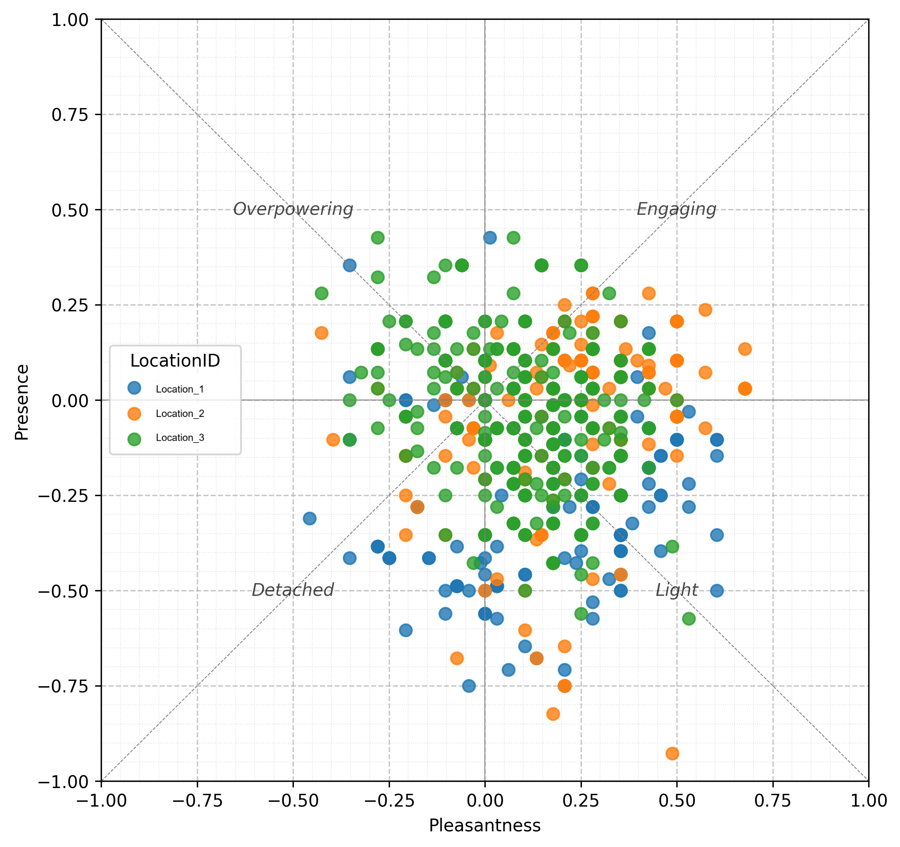

<!-- markdownlint-disable MD041 -->
## **What is a Smellscape?**
In 1985, **Porteous** introduced the **smellscape** concept [[1]](#ref1), which can be described as the **smell environment perceived and understood by a person in a place**. Distinguishing between **"smell"** (i.e., a sensation detected by inhaling airborne molecules of a substance) and **"odour"** (i.e., the combined substances in the air causing olfactory sensations), the former emphasizes the human experience as a perceptual construct, making it a **user-centred** approach within the built environment community. This definition originated and is used in outdoor settings and it was later adapted to **indoor environments** as the **smell environment perceived and understood by a person in an indoor context** [[2]](#ref2). The term **"context"**, as opposed to the original term **"place"**, also accounts for **social**, **cultural**, and **historical** aspects [[2]](#ref2). 

## **The Circumplex Model of Indoor Smellscape Perception**
Research suggested that indoor smellscape perception can be measured using eight Perceived Affective Qualities (PAQ): **Pleasant**, **Present**, **Light**, **Engaging**, **Unpleasant**, **Absent**, **Overpowering**, **Detached**. The eight PAQs can be organized into a circular structure called a **"circumplex model"**. This model suggests that indoor smellscape perception can be organized in a two-dimensional space defined by two orthogonal axes — **Pleasantness** and **Presence** — with two additional axes, **Engagement** and **Power**, rotated 45° within the same plane [[3]](#ref3).

## **What is SmellscaPy?**

**SmellscaPy** is a Python library for analysing and representing **indoor smellscape perceptual data**.  
It provides tools for **data validation, calculation of perceptual indices, visualization, descriptive statistics and modelling** to support reproducible research in smellscape studies.

## **Key Features**

- **Data validation & preprocessing** of smellscape survey datasets  
- **Computation of perceptual indicators** (i.e., pleasantness, presence)  
- **Visualizations**: scatter plots, density plots, simplified density plots, dynamic plots 
- **Integration with the Python scientific stack** (Pandas, NumPy, Matplotlib)  
- **Ready-to-use example datasets** for tutorials and testing
- **Analysis**: descriptive statistics and modelling

## **Use Cases**
SmellscaPy can be used to analyse and interpret perceptual data related to olfactory experiences across a wide range of research and application domains:

- **Post-occupancy evaluation (POE) and Indoor Environmental Quality (IEQ) research**: to analyse and visualise subjective data on the impact of odours in built environments, supporting advanced analyses in post-occupancy studies and indoor comfort research.
- **Material development and smell-oriented design**: to analyse perceptual feedback collected during the testing of materials with olfactory properties or during the evaluation of smell-oriented architectural solutions, facilitating research and development of sensory-integrated products.
- **Cognitive science and environmental psychology**: to investigate affective responses to odours.
- **Cultural heritage and olfactory identity**: to document smellscapes associated with places, practices, and traditions, contributing to the protection and enhancement of cultural identity through the sensory dimension.
- **Virtual reality and immersive simulations**: to integrate olfactory perception into multisensory experimental setups and virtual environments, enabling the study of smell-related responses in controlled and interactive scenarios.

## **References**
1.  J.D. Porteous, Smellscape, Progress in Physical Geography: Earth and Environment 9 (1985) 356–378. https://doi.org/10.1177/030913338500900303.
2.  G. Torriani, S. Torresin, I. Lara-Ibeas, R. Albatici, F. Babich, Perceived air quality (PAQ) assessment methods in office buildings: a systematic review towards an indoor smellscape approach, Build Environ (2024) 111645. https://doi.org/10.1016/j.buildenv.2024.111645.
3.  G. Torriani, R. Albatici, F. Babich, M. Vescovi, M. Zampini, S. Torresin, Developing a principal components model of indoor smellscape perception in office buildings, Build Environ 279 (2025) 113044. https://doi.org/10.1016/j.buildenv.2025.113044.