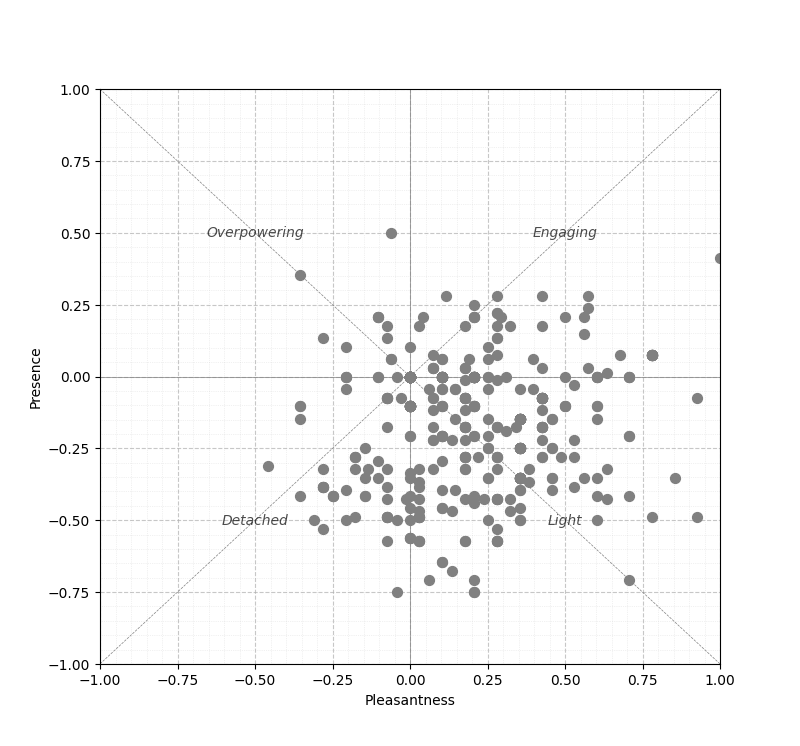
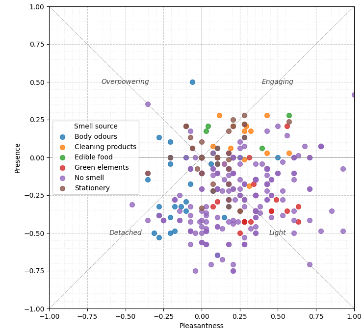
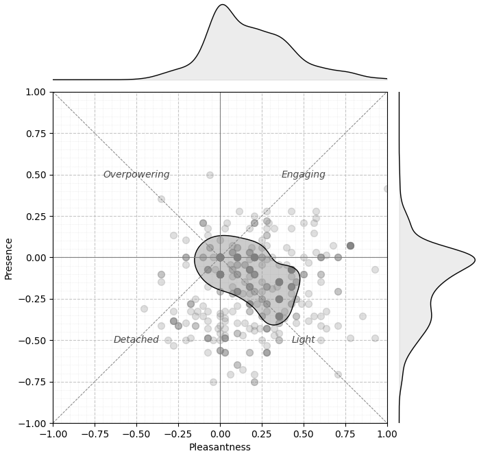
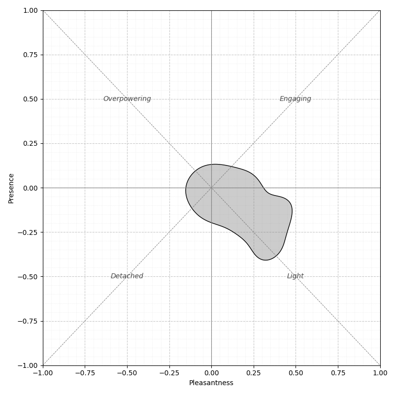
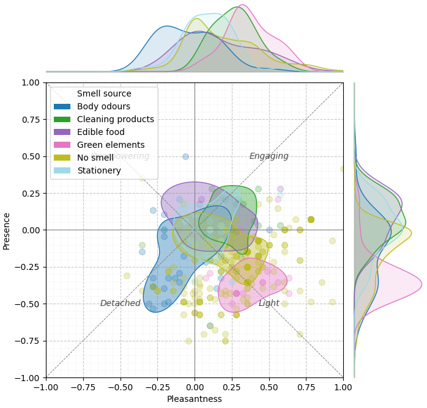
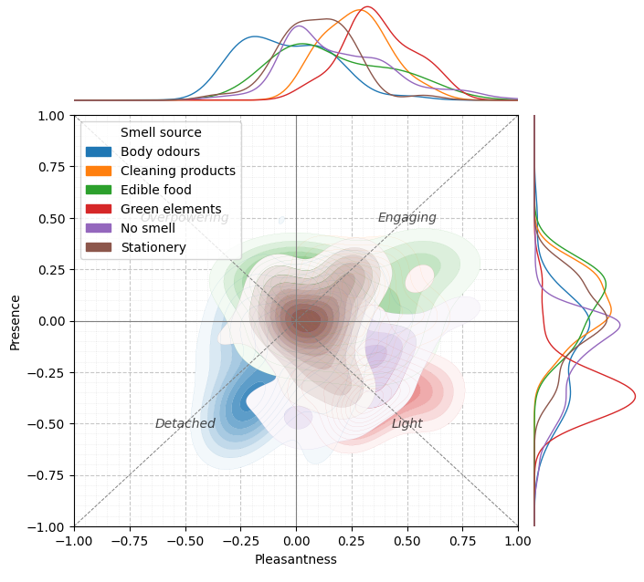

SmellscaPy provides the following functions for data visualisation:

- `plot_scatter()` – creates a two-dimensional scatter plot that visualises the relationship between Pleasantness and Presence for each observation.
- `plot_simple_density()` – displays a simplified 2D Kernel Density Estimation (KDE) density plot using only the 50th percentile contour of the distribution. Optionally, the plot can also include the scatter distribution and 1D KDE marginal distributions.
- `plot_density()` – visualises the full 2D density distribution of the dataset using KDE.Optionally, the plot can also include the scatter distribution and 1D KDE marginal distributions.
- `plot_dynamic()` – makes the simple density plot dynamic, showing the temporal evolution of perception over time.

Since all SmellscaPy plotting functions are built on matplotlib and seaborn, you can easily customise them by passing additional arguments or modifying the returned plot objects — for example, adjusting figure size, colour palettes, or adding annotations for publication-quality visuals.

## **Plot scatter**
This function creates a **2D scatter plot** of perceptual data, specifically plotting pleasantness_score on the x-axis and presence_score on the y-axis. It is designed to visually represent the distribution of samples in a perceptual space and optionally **group them** by a categorical variable.
You can customise almost everything in the plot by passing keyword arguments when calling the function. Examples of commonly customised options:

- Plot size and axis ranges (figsize, xlim, ylim)
- Point style (point_color, point_size)
- Grid style and tick spacing (grid_major, grid_minor, xmajor_step, etc.)
- Quadrant labels and text style (labels, labels_style)
- Grouping by a column (group_col)
- Saving settings (filename, dpi)

```python
#Basic visualisation
plot_scatter(df)
```


```python
#Grouping
plot_scatter(
    df,
    figsize=(10, 10),
    group_col = "Smell source",
    filename="Figure1.png"
)
```


## **Plot simple density**
This function creates a visualisation with:

- A **2D KDE** (kernel density estimate) drawn as a single HDR contour (by default the **50% highest-density region**)
- Optional **1D KDE marginals** on the top (x) and right (y) axes.
- Optional **scatter points**
- Optional **grouping**: draws the HDR contour, marginals, and points per group.

You can customise almost everything in the plot by passing keyword arguments when calling the function.

```python
#Basic visualisation
plot_simple_density(df)
```


```python
#No marginals, no scatter points
plot_simple_density(
    df,
    show_marginals = False,
    show_points= False
)
```


```python
#Grouping
plot_simple_density(
    df,
    group_col="Smell source",
    palette="tab20"
)
```


## **Plot density**
This function creates a visualisation with:

- A full **2D KDE** (kernel density estimate) of the data, using either filled contours (contourf) or line contours (contour)
- Optional **1D KDE marginals** on the top (x) and right (y) axes.
- Optional **scatter points**
- Optional **per-group densities**, each group with its own colour and legend.

You can customise almost everything in the plot by passing keyword arguments when calling the function.

```python
#Basic visualisation
plot_density(df)
```


```python
#Grouping
plot_simple_density(
    df,
    group_col="Smell source"
)
```


## **Plot dynamics**
This function creates a visualisation with: